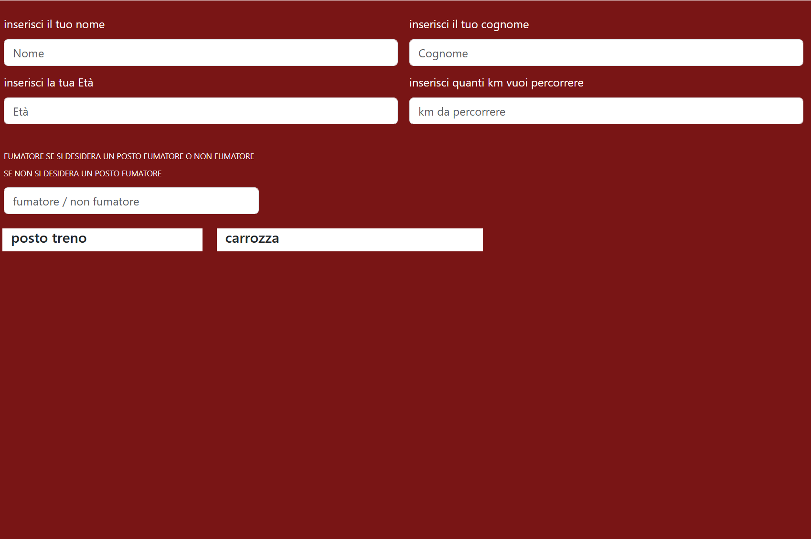

#BIIGLIETTERIA DEL TRENO ONLINE

Una semplice applicazione  che permette all'utente di scegliere il chilometraggio da percorrere il posto fumatore non fumatore  la carrozza ed il posto prenotato ed in oltre se ha da 0 a 17 anni avra lo sconto young da 18 a 64 nulla da 65 a 100 lo sconto senior. per ora è solo l'inizio seguiranno altre info e screen,
i linguaggi che userò sono Javascript css html e integro bootstrap.

.

-------------------------------------------------------------------------------------------------------------
-------------------------------------------------------------------------------------------------------------
-------------------------------------------------------------------------------------------------------------

Terminata la parte grafica ora procederò con la logica di funzionamento 

.png).

ultimata tutta la parte logica implementata con Javascript 
ho aggiunto delle icone per abbellire l'app con l'npm di fontaweshome
parte grafica mi son aiutato con bootstrap